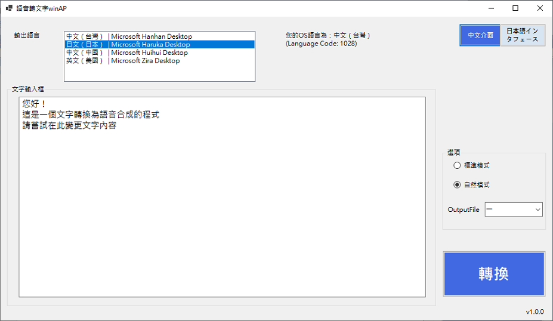

# 文字轉語音工具(Microsoft Speach API)

## 說明

* 基於Microsoft Speach API所實現之語音合成工具
* 提供將文字生成語音(念出)、語音檔案
* 調整模式係利用SSML標記語言調整自然度
* 支援的語言和語音請參考[微軟官網](https://support.microsoft.com/zh-tw/windows/%E9%99%84%E9%8C%84-a-%E6%94%AF%E6%8F%B4%E7%9A%84%E8%AA%9E%E8%A8%80%E5%92%8C%E8%AA%9E%E9%9F%B3-4486e345-7730-53da-fcfe-55cc64300f01#WindowsVersion=Windows_11)
* SSML參考([點此](https://learn.microsoft.com/en-us/previous-versions/office/developer/speech-technologies/hh361578(v=office.14)?redirectedfrom=MSDN))
* 執行檔Demo/TextSpeechKT.exe

## 專案資訊

1. .Net code(.NET 6)
2. C#
3. winForm
4. 執行檔：\Demo\TextSpeechKT.exe

